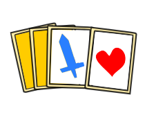
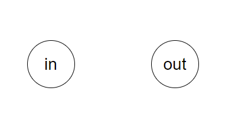
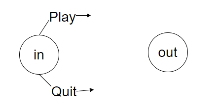
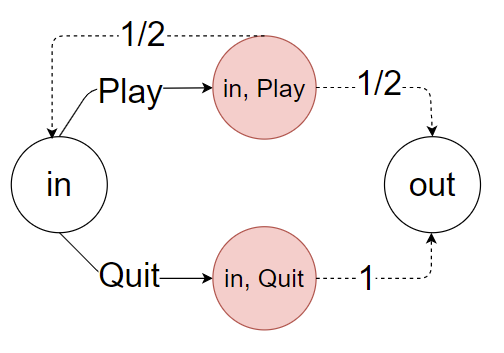
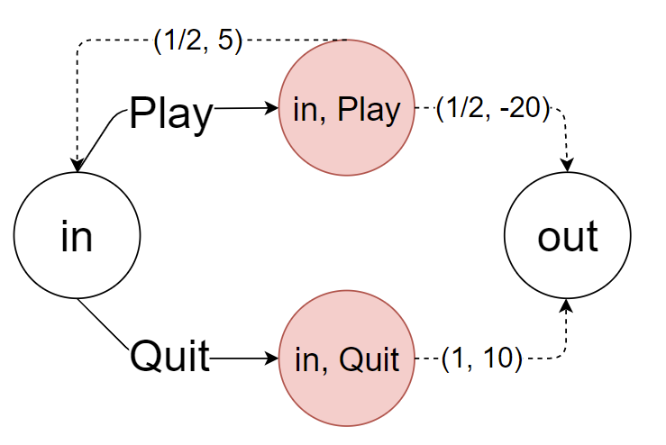

# Markov Decision Process

Markov Decision Process (MDP) is a framework to model a scenario which actions will lead to random outcomes. The main components of MDP are:

- states

- actions

- chance nodes

- transition rates

I will use an example to illustrate the MDP concept.

# A Blue/Red Card Game

Suppose there is a deck of cards in front of you. You can choose to flip a card. The card has either a blue sword or a red heart on it. You can decide to flip a card, or quit the game and get $10. If you choose to flip a card, there are two outcomes:

- If you flip a card that has a blue sword picture, you need to pay $20, and your game is over. 

- If you flip a card that has a red heart picture, you get $5, and you can decide to keep playing the game or quit the game.

Now, let's model this game using MDP.

## States

There are two states in this game, which are in and out. The in state means that you are still in the game, and this happens when you flip a red heart card, or when you just started the game. The out state means that you flipped a blue sword card and can no longer play this game, or you have decided to quit the game.

Let's use circles to represent states.

## Actions

When you are at a state, you may have some available actions to perform. In MDP, you need to perform an action in a state to transit to another state. If a state has no available actions, you cannot transit to other states because you cannot do anything. As a result, a state with no actions is called **absorbing state** because it absorbs you and will not let you go.

When you are in the in state, you have two available:

- play

- quit

However, when you are in the out state, you do not have any available action. Therefore, we can say out state is an absorbing state or end state.

## Chance Nodes

If you take an action of Play, the outcome is random and depends on the probability. We call the probability from one state to another state transition rate. A characteristic of Markov Decision Process is that we incorporate randomness into the model. Therefore, we introduce chance nodes here to represent the randomness of outcomes.

The probability of flipping a blue sword card depends on the number of blue sword cards and the number of red heart cards in the deck. Let's assume that the numbers of both the blue sword and the read heart cards are the same. Hence, the probability of flipping a blue sword or a red heart card is 50%.

Also, if you take an action of Quit, although we know that taking an action of Quit will result in immediate out state, we can still use a chance node to represent it by giving it 100% chance leading to the out state.

## Rewards

For each outcome, there is an associated reward. For example, if you take an action of Play and flip a red heart card, you earn a reward of $5. On the other hand, if you flip a blue sword card, you get a punishment of $20, so your reward is a negative number -$20.

We represent rewards with its transition rate together using a bracket. For example, for taking an action of Play and flip a red heart card, we use this notation (1/2, 5) to represent the transition rate and the associated reward.

Now, we have a MDP model for this game. We want to find the optimal policy $\pi_{opt}$ that tells us the optimal action for each state. The policy $\pi_{opt}$ is a mapping between states and actions. Given a state to the policy $\pi$, it returns an optimal action for the given state.

We can use value iteration algorithm to find the optimal policy $\pi_{opt}$.
